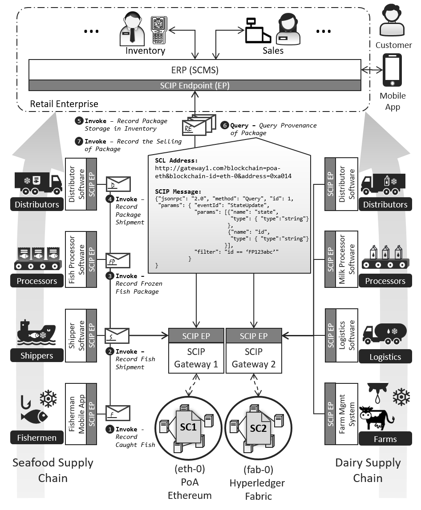

# Unified Integration of Smart Contracts through Service Orientation - A Case-Study

## Introduction

A case-study that shows how the [Smart Contract Locator (SCL)](https://github.com/ghareeb-falazi/scl), the [Smart Contract Description Language (SCDL)](https://github.com/floriandanielit/scdl), and the [Smart Contract Invocation Protocol (SCIP)](https://github.com/lampajr/scip) can be used in combination to support the integration of heterogeneous multi-blockchain setups into client applications.

The following picture highlights the distributed system that is invloved in the case study:

The system focuses on a retailer enterprise that is connected to two supply chains (one for seafood products and one for dairy products).
The two supply chains are managed by two blockchains ([Ethereum](https://ethereum.org/) and [Hyperledger Fabric](https://www.hyperledger.org/projects/fabric)).
Access to the blockchains is provided by two [SCIP Gateways](https://github.com/ghareeb-falazi/BlockchainAccessLayer), which can be activated using SCIP messages addressed at appropriate SCL addresses.
We will create the various components of this system, bring it up and then run a sample the client application against it.
The sample client application allows the various roles presented in the figure to update the corresponding blockchains with supply-chain-related actoins.
Furthermore, it allows the end-customer to query the provenance of a given fish package or a milk carton.

## Prerequisits

- Active internet connection :)
- [Docker](https://www.docker.com/) with [Docker-Compose](https://docs.docker.com/compose/)
- [Git bash](https://git-scm.com/downloads) (for Windows users)
- The ports 4200, 7050, 7051, 7054, 8080, 8081, 8082 8545 must be avaialable at the host machine.

## Setup

- The following instructions assume you are using Windows. Otherwise, ignore the requirement that you need to run the commands using git bash, since bash will be readily available for you.
- Using git bash, navigate to the `AutomateSetup` directory, and run the shell script `Start.sh`, i.e., 
  ```
  > cd AutomateSetup
  > ./Start.sh
  ```
   This will pull/create the necessary docker images, execute the docker-compose file to bring up the various docker containers needed, and deploy the Ethereum and Fabric smart contracts.
- When the script is fully executed, you can proceed to the [Demo](#demo) section below.
- At the end, you can bring down the network with the command 

  ```
  > ./Stop.sh
  ```

  You can also remove BAL and ganache-cli images by combining the previous command with the `rmi` option as follows:
  
  ```
  > ./Stop.sh rmi
  ``` 
 
## Demo

Coming soon!
- __A Video of this demo is [available on Youtube]()__

## Notes

- The crpyto artifacts for Fabric are already generated. If you need to generate them again use the script [generate.sh](./AutomateSetup/fabric/_defaults-generation/generate.sh). Then you need to update the keyfile name mentioned inside the [docker-compose file](./AutomateSetup/docker-compose.yml) (in the `ca` service specification).
